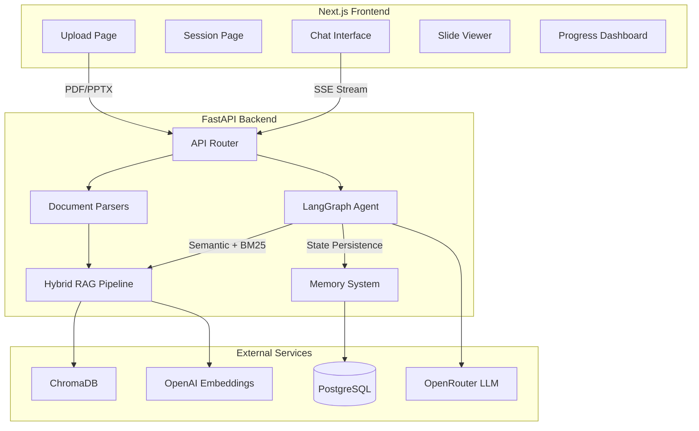

# SlideGuide

AI-powered tutoring from your lecture slides. Upload a PDF or PPTX, and SlideGuide creates a personalized study session with adaptive explanations, interactive quizzes, and progress tracking — designed for neurodivergent learners.

## Architecture



## Tech Stack

| Layer | Technology | Purpose |
|-------|-----------|---------|
| Frontend | Next.js 14, TypeScript, Tailwind CSS, Zustand | UI and state management |
| Backend | FastAPI, Python 3.11+ | API server |
| Agent | LangGraph | Multi-node stateful tutoring agent |
| LLM | OpenRouter (Claude Sonnet/Haiku, DeepSeek fallback) | Reasoning and generation |
| Embeddings | OpenAI text-embedding-3-small | Semantic search vectors |
| Vector DB | ChromaDB | Semantic similarity search |
| Database | PostgreSQL + Prisma | Session, progress, cost tracking |
| RAG | Hybrid search (semantic + BM25) → RRF → MMR | Retrieval pipeline |

## Key Features

- **5 explanation modes**: Standard, Analogy, Visual, Step-by-Step, ELI5
- **3 pacing levels**: Slow, Medium, Fast
- **Adaptive quizzes**: Difficulty auto-adjusts based on performance
- **Hybrid retrieval**: Semantic + keyword search with diversity ranking
- **VLM image understanding**: Describes charts, diagrams, and images from slides
- **Progress tracking**: Topics covered, quiz scores, confidence levels
- **SSE streaming**: Real-time token-by-token response streaming
- **Circuit breaker**: Automatic fallback between LLM providers

## Setup

### Prerequisites

- Python 3.11+
- Node.js 18+
- Docker and Docker Compose
- OpenRouter API key
- OpenAI API key (for embeddings)

### 1. Clone and configure

```bash
git clone https://github.com/yourusername/slideguide.git
cd slideguide
cp .env.example .env
# Edit .env with your API keys
```

### 2. Start infrastructure

```bash
docker compose up -d
```

This starts PostgreSQL (port 5432) and ChromaDB (port 8000).

### 3. Backend setup

```bash
# Install Python dependencies
pip install -e ".[dev]"

# Generate Prisma client and run migrations
prisma generate
prisma db push

# Start the API server
uvicorn backend.main:app --reload --port 8000
```

### 4. Frontend setup

```bash
cd frontend
npm install
npm run dev
```

Visit `http://localhost:3000` to start using SlideGuide.

### 5. Run tests

```bash
pytest tests/ -v
```

## Project Structure

```
slideguide/
├── backend/
│   ├── agent/          # LangGraph tutoring agent
│   │   ├── graph.py    # Graph assembly and routing
│   │   ├── nodes.py    # Agent nodes (router, explain, quiz, etc.)
│   │   ├── prompts.py  # Neurodivergent-friendly prompt templates
│   │   ├── state.py    # TutorState schema
│   │   └── tools.py    # 7 agent tools (search, quiz, progress, etc.)
│   ├── llm/            # LLM clients
│   │   ├── client.py   # OpenRouter with retry + circuit breaker
│   │   ├── models.py   # Model configs and pricing
│   │   ├── streaming.py # SSE stream handler
│   │   └── vision.py   # VLM image understanding
│   ├── memory/         # Persistence layer
│   │   ├── session_memory.py    # Conversation summarization
│   │   └── student_progress.py  # Long-term progress tracking
│   ├── models/
│   │   └── schemas.py  # All Pydantic models
│   ├── monitoring/     # Observability
│   │   ├── health.py   # Health checks (liveness, readiness)
│   │   ├── logger.py   # Structured logging (structlog)
│   │   └── metrics.py  # Cost and performance tracking
│   ├── parsers/        # Document parsing
│   │   ├── pdf_parser.py   # PyMuPDF
│   │   ├── pptx_parser.py  # python-pptx
│   │   └── ocr.py          # Tesseract + VLM fallback
│   ├── rag/            # Retrieval pipeline
│   │   ├── vectorstore.py  # ChromaDB wrapper
│   │   ├── ingestion.py    # Chunking + embedding + BM25 index
│   │   ├── retriever.py    # Hybrid search → RRF → MMR
│   │   └── evaluation.py   # Retrieval metrics logging
│   ├── routes/
│   │   └── chat.py     # Session and message API endpoints
│   ├── config.py       # Application settings
│   └── main.py         # FastAPI app entry point
├── frontend/
│   ├── app/            # Next.js app router pages
│   ├── components/     # React components
│   ├── lib/            # API client, store, types, utils
│   └── package.json
├── database/
│   └── schema.prisma   # Database schema
├── tests/              # Python tests
├── docker-compose.yml  # PostgreSQL + ChromaDB
└── pyproject.toml      # Python project config
```

## Skills Showcase

| Skill | Implementation |
|-------|---------------|
| **RAG Pipeline** | Hybrid search (semantic + BM25), Reciprocal Rank Fusion, MMR diversity ranking |
| **Agentic AI** | LangGraph multi-node graph with conditional routing, tool calling, state persistence |
| **LLM Engineering** | Retry with exponential backoff, circuit breaker, model fallback chain, cost tracking |
| **Prompt Engineering** | 5 explanation modes, adaptive quiz difficulty, neurodivergent-friendly formatting |
| **Document Processing** | PDF (PyMuPDF) + PPTX parsing, OCR with VLM fallback, slide-aware chunking |
| **Multimodal** | VLM image descriptions for charts/diagrams, base64 encoding, context injection |
| **Streaming** | SSE token-by-token streaming, tool call assembly, heartbeat keepalive |
| **Observability** | Structured logging (structlog), per-model metrics, health checks (live/ready) |
| **Database Design** | Prisma ORM, PostgreSQL, session/progress/cost models, cascade deletes |
| **Frontend** | Next.js 14, Zustand state, SSE consumption, responsive 3-column layout, dark mode |
