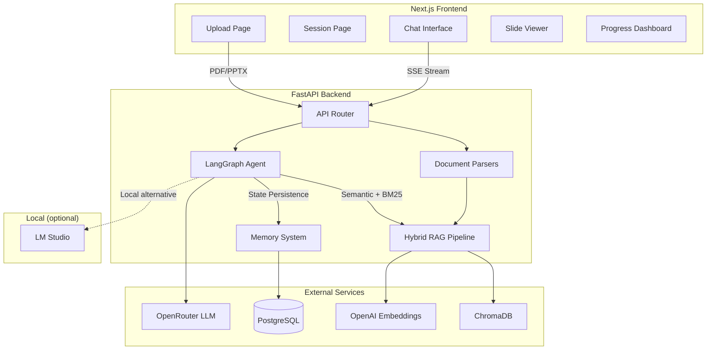

# SlideGuide

AI-powered tutoring from your lecture slides. Upload a PDF or PPTX, and SlideGuide creates a personalized study session with adaptive explanations, interactive quizzes, and progress tracking — designed for neurodivergent learners.

## Architecture



## Tech Stack

| Layer | Technology | Purpose |
|-------|-----------|---------|
| Frontend | Next.js 14, TypeScript, Tailwind CSS, Zustand | UI and state management |
| Backend | FastAPI, Python 3.11+ | API server |
| Agent | LangGraph | Multi-node stateful tutoring agent |
| LLM | OpenRouter (Claude Sonnet/Haiku, DeepSeek fallback) or LM Studio (local) | Reasoning and generation |
| Embeddings | OpenAI text-embedding-3-small or local embedding model | Semantic search vectors |
| Vector DB | ChromaDB | Semantic similarity search |
| Database | PostgreSQL + Prisma | Session, progress, cost tracking |
| RAG | Hybrid search (semantic + BM25) → RRF → MMR | Retrieval pipeline |

## Key Features

- **5 explanation modes**: Standard, Analogy, Visual, Step-by-Step, ELI5
- **3 pacing levels**: Slow, Medium, Fast
- **Adaptive quizzes**: Difficulty auto-adjusts based on performance
- **Hybrid retrieval**: Semantic + keyword search with diversity ranking
- **VLM image understanding**: Describes charts, diagrams, and images from slides
- **Progress tracking**: Topics covered, quiz scores, confidence levels
- **SSE streaming**: Real-time token-by-token response streaming
- **Circuit breaker**: Automatic fallback between LLM providers
- **Local LLM support**: Run entirely offline with LM Studio — auto-discovers models, adapts tool calling

## Setup

### Prerequisites

- Python 3.11+
- Node.js 18+
- Docker and Docker Compose
- OpenRouter API key (cloud mode) **or** [LM Studio](https://lmstudio.ai/) (local mode)
- OpenAI API key (for embeddings in cloud mode)

### 1. Clone and configure

```bash
git clone https://github.com/yourusername/slideguide.git
cd slideguide
cp .env.example .env
# Edit .env with your API keys
```

### 2. Start infrastructure

```bash
docker compose up -d
```

This starts PostgreSQL (port 5432) and ChromaDB (port 8000).

### 3. Backend setup

```bash
# Install Python dependencies
pip install -e ".[dev]"

# Generate Prisma client and run migrations
prisma generate
prisma db push

# Start the API server
uvicorn backend.main:app --reload --port 8000
```

### 4. Frontend setup

```bash
cd frontend
npm install
npm run dev
```

Visit `http://localhost:3000` to start using SlideGuide.

### 5. Run tests

```bash
pytest tests/ -v
```

## Using Local LLMs (LM Studio)

SlideGuide can run entirely offline using local models via [LM Studio](https://lmstudio.ai/), with no API keys required for chat. This uses the same OpenAI-compatible API that the cloud path uses, so the switch is purely configuration.

### Quick start

1. **Install and launch [LM Studio](https://lmstudio.ai/)**
2. **Download a model** — any GGUF model works. Recommended:
   - Chat: `mistral-nemo-instruct`, `llama-3.1-8b-instruct`, or `qwen2.5-7b-instruct`
   - Embeddings: `nomic-embed-text-v1.5` or `bge-small-en-v1.5`
3. **Load the model** and start LM Studio's local server (default: `http://localhost:1234`)
4. **Set your `.env`**:

```bash
# Switch providers to local
LLM_PROVIDER=lmstudio
EMBEDDING_PROVIDER=lmstudio    # optional — keeps OpenAI embeddings if omitted
VISION_PROVIDER=lmstudio       # optional — only if your model supports vision

# LM Studio connection
LMSTUDIO_BASE_URL=http://localhost:1234/v1

# Model names — leave empty to auto-discover from LM Studio
LMSTUDIO_PRIMARY_MODEL=
LMSTUDIO_ROUTING_MODEL=
LMSTUDIO_EMBEDDING_MODEL=
```

5. **Start SlideGuide normally** — the backend auto-discovers loaded models from LM Studio.

### Provider configuration

Each capability (chat, embeddings, vision) can be pointed at a different provider independently:

| Variable | Options | Default |
|----------|---------|---------|
| `LLM_PROVIDER` | `openrouter`, `lmstudio` | `openrouter` |
| `EMBEDDING_PROVIDER` | `openai`, `lmstudio` | `openai` |
| `VISION_PROVIDER` | `openrouter`, `lmstudio` | `openrouter` |

**Hybrid example** — local chat with cloud embeddings (best quality retrieval, free generation):

```bash
LLM_PROVIDER=lmstudio
EMBEDDING_PROVIDER=openai
OPENAI_API_KEY=sk-...
```

### How it works

- **Auto-discovery**: On startup, the backend queries `GET /v1/models` on LM Studio to find loaded models. If `LMSTUDIO_PRIMARY_MODEL` is empty, it picks the first available model.
- **Tool compatibility**: Local models have inconsistent function-calling support. SlideGuide starts with native OpenAI-format tool calling, and if the model fails to produce valid tool calls 3 times in a row, it auto-switches to a prompt-based fallback that injects tool schemas into the system prompt and parses JSON blocks from the response.
- **Zero cost tracking**: All local model calls are tracked at $0.00 — no cost limits apply.
- **Health checks**: `GET /api/settings/provider` reports LM Studio connectivity and loaded model count.
- **No fallback chain**: Unlike cloud mode (which falls back from Claude to DeepSeek), local mode uses a single model with no fallback.

### Verifying the connection

Once running, check the provider status:

```bash
curl http://localhost:8000/api/settings/provider
```

You should see:

```json
{
  "llm_provider": "lmstudio",
  "models": { "primary": "your-model-name", ... },
  "lmstudio": { "status": "ok", "models_loaded": 1 }
}
```

### Tips

- **RAM**: 7B models need ~6 GB RAM, 13B models need ~10 GB. Keep this in mind alongside ChromaDB and PostgreSQL.
- **GPU offloading**: Enable GPU layers in LM Studio for much faster inference.
- **Routing model**: If unset, the primary model handles both reasoning and routing. For faster routing, load a smaller model and set `LMSTUDIO_ROUTING_MODEL` to its name.
- **Embedding model**: Must be loaded separately in LM Studio alongside your chat model. If you skip local embeddings, keep `EMBEDDING_PROVIDER=openai` — OpenAI's embeddings are cheap and high quality.

## Project Structure

```
slideguide/
├── backend/
│   ├── agent/          # LangGraph tutoring agent
│   │   ├── graph.py    # Graph assembly and routing
│   │   ├── nodes.py    # Agent nodes (router, explain, quiz, etc.)
│   │   ├── prompts.py  # Neurodivergent-friendly prompt templates
│   │   ├── state.py    # TutorState schema
│   │   └── tools.py    # 7 agent tools (search, quiz, progress, etc.)
│   ├── llm/            # LLM clients
│   │   ├── client.py   # OpenRouter with retry + circuit breaker
│   │   ├── discovery.py # LM Studio model auto-discovery
│   │   ├── models.py   # Model configs and pricing
│   │   ├── providers.py # Provider config resolution (cloud vs local)
│   │   ├── streaming.py # SSE stream handler
│   │   ├── tool_compatibility.py # Native ↔ prompt-based tool use adapter
│   │   └── vision.py   # VLM image understanding
│   ├── memory/         # Persistence layer
│   │   ├── session_memory.py    # Conversation summarization
│   │   └── student_progress.py  # Long-term progress tracking
│   ├── models/
│   │   └── schemas.py  # All Pydantic models
│   ├── monitoring/     # Observability
│   │   ├── health.py   # Health checks (liveness, readiness)
│   │   ├── logger.py   # Structured logging (structlog)
│   │   └── metrics.py  # Cost and performance tracking
│   ├── parsers/        # Document parsing
│   │   ├── pdf_parser.py   # PyMuPDF
│   │   ├── pptx_parser.py  # python-pptx
│   │   └── ocr.py          # Tesseract + VLM fallback
│   ├── rag/            # Retrieval pipeline
│   │   ├── vectorstore.py  # ChromaDB wrapper
│   │   ├── ingestion.py    # Chunking + embedding + BM25 index
│   │   ├── retriever.py    # Hybrid search → RRF → MMR
│   │   └── evaluation.py   # Retrieval metrics logging
│   ├── routes/
│   │   ├── chat.py     # Session and message API endpoints
│   │   └── settings.py # Provider status and model listing
│   ├── config.py       # Application settings
│   └── main.py         # FastAPI app entry point
├── frontend/
│   ├── app/            # Next.js app router pages
│   ├── components/     # React components
│   ├── lib/            # API client, store, types, utils
│   └── package.json
├── database/
│   └── schema.prisma   # Database schema
├── tests/              # Python tests
├── docker-compose.yml  # PostgreSQL + ChromaDB
└── pyproject.toml      # Python project config
```

## Skills Showcase

| Skill | Implementation |
|-------|---------------|
| **RAG Pipeline** | Hybrid search (semantic + BM25), Reciprocal Rank Fusion, MMR diversity ranking |
| **Agentic AI** | LangGraph multi-node graph with conditional routing, tool calling, state persistence |
| **LLM Engineering** | Retry with exponential backoff, circuit breaker, model fallback chain, cost tracking, local LLM support via LM Studio |
| **Provider Abstraction** | Pluggable provider config, auto-discovery of local models, adaptive tool-calling compatibility layer |
| **Prompt Engineering** | 5 explanation modes, adaptive quiz difficulty, neurodivergent-friendly formatting |
| **Document Processing** | PDF (PyMuPDF) + PPTX parsing, OCR with VLM fallback, slide-aware chunking |
| **Multimodal** | VLM image descriptions for charts/diagrams, base64 encoding, context injection |
| **Streaming** | SSE token-by-token streaming, tool call assembly, heartbeat keepalive |
| **Observability** | Structured logging (structlog), per-model metrics, health checks (live/ready) |
| **Database Design** | Prisma ORM, PostgreSQL, session/progress/cost models, cascade deletes |
| **Frontend** | Next.js 14, Zustand state, SSE consumption, responsive 3-column layout, dark mode |
