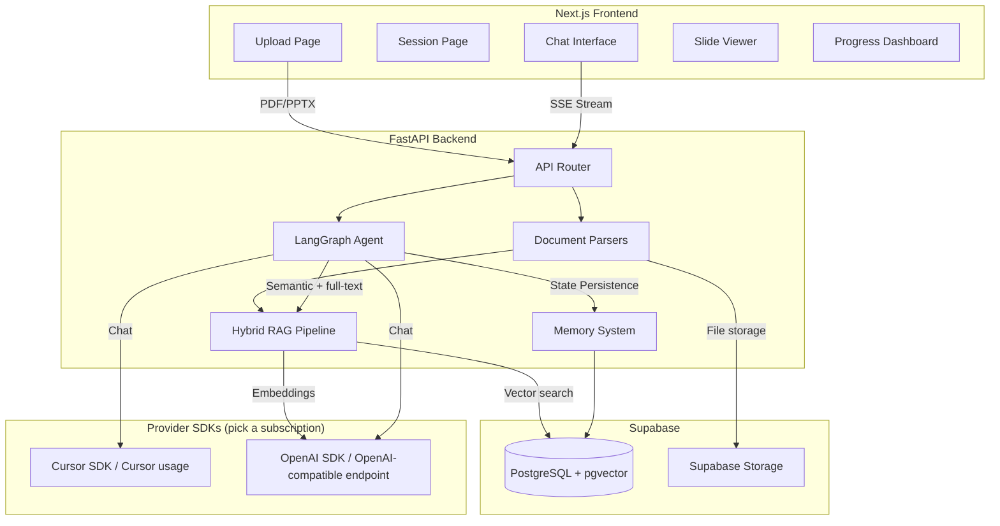

# SlideGuide

AI-powered tutoring from your lecture slides. Upload a PDF or PPTX, and SlideGuide creates a personalized study session with adaptive explanations, interactive quizzes, and progress tracking — designed for neurodivergent learners.

## Architecture


```mermaid
graph TB
    subgraph Frontend["Next.js Frontend"]
        Upload[Upload Page]
        Session[Session Page]
        Chat[Chat Interface]
        Slides[Slide Viewer]
        Progress[Progress Dashboard]
    end

    subgraph API["FastAPI Backend"]
        Router[API Router]
        Parsers[Document Parsers]
        RAG[Hybrid RAG Pipeline]
        Agent[LangGraph Agent]
        Memory[Memory System]
    end

    subgraph LLM["Provider SDKs (pick a subscription)"]
        CursorSDK[Cursor SDK / Cursor usage]
        Endpoint[OpenAI SDK / OpenAI-compatible endpoint]
    end

    subgraph Supabase["Supabase"]
        Postgres[(PostgreSQL + pgvector)]
        Storage[Supabase Storage]
    end

    Upload -->|PDF/PPTX| Router
    Chat -->|SSE Stream| Router
    Router --> Parsers --> RAG
    Router --> Agent
    Agent -->|Semantic + full-text| RAG
    Agent -->|State Persistence| Memory
    RAG -->|Vector search| Postgres
    RAG -->|Embeddings| Endpoint
    Agent -->|Chat| CursorSDK
    Agent -->|Chat| Endpoint
    Memory --> Postgres
    Parsers -->|File storage| Storage
```

## Tech Stack

| Layer | Technology | Purpose |
|-------|-----------|---------|
| Frontend | Next.js 14, TypeScript, Tailwind CSS, Zustand | UI and state management |
| Backend | FastAPI, Python 3.11+ | API server |
| Agent | LangGraph | Multi-node stateful tutoring agent |
| LLM | Cursor SDK (`cursor-sdk`) or any OpenAI-compatible endpoint | Reasoning and generation (Cursor usage or endpoint bill) |
| Embeddings | Any OpenAI-compatible embeddings endpoint (1536-d) | Semantic search vectors |
| Database | Supabase (PostgreSQL + pgvector) | Vector search, sessions, progress, cost tracking |
| Storage | Supabase Storage | Uploaded file persistence |
| RAG | Hybrid search (semantic + full-text) → RRF → MMR | Retrieval pipeline |

## Key Features

- **5 explanation modes**: Standard, Analogy, Visual, Step-by-Step, ELI5
- **3 pacing levels**: Slow, Medium, Fast
- **Adaptive quizzes**: Difficulty auto-adjusts based on performance
- **Hybrid retrieval**: Semantic + keyword search with diversity ranking
- **VLM image understanding**: Describes charts, diagrams, and images from slides
- **Progress tracking**: Topics covered, quiz scores, confidence levels
- **SSE streaming**: Real-time token-by-token response streaming
- **Circuit breaker**: Retries with backoff and opens on repeated endpoint failures
- **Bring-your-own endpoint**: Point at any OpenAI-compatible API — cloud or fully offline/keyless (Ollama, vLLM, LocalAI, …)
- **Cursor subscription**: Set `LLM_PROVIDER=cursor` (or switch in the session banner) to bill tutoring chat to Cursor usage via the official Python SDK. Composer models are preferred first.

## Setup

### Prerequisites

- Python 3.11+
- Node.js 18+
- [Docker](https://docs.docker.com/get-docker/) (required by Supabase CLI)
- [Supabase CLI](https://supabase.com/docs/guides/cli) (or a hosted Supabase project)
- A chat provider: a [Cursor API key](https://cursor.com/dashboard/api) and/or an OpenAI-compatible endpoint for chat + embeddings (see [Choosing your LLM](#choosing-your-llm-provider-sdk))
- [Tesseract OCR](https://github.com/tesseract-ocr/tesseract) (optional — only needed for OCR on image-heavy slides)

### 1. Clone and configure

```bash
git clone https://github.com/yourusername/slideguide.git
cd slideguide
cp .env.example .env
# Edit .env with your API keys and Supabase credentials
```

### 2. Start Supabase

```bash
# Start local Supabase (runs PostgreSQL with pgvector, Storage, and more)
supabase start

# Apply database migrations
supabase db reset
```

This starts PostgreSQL with pgvector (port 54322), Supabase API (port 54321), and Supabase Storage. The migrations create all required tables, enable pgvector, and configure the storage bucket.

After `supabase start` finishes, it prints your local credentials. Copy the `anon key` and `service_role key` values into your `.env`:

```bash
SUPABASE_URL=http://127.0.0.1:54321
SUPABASE_ANON_KEY=<anon key from supabase start output>
SUPABASE_SERVICE_ROLE_KEY=<service_role key from supabase start output>
```

### 3. Backend setup

```bash
# Install Python dependencies
pip install -e ".[dev]"

# Start the API server
uvicorn backend.main:app --reload --port 8000
```

### 4. Frontend setup

```bash
cd frontend
npm install
npm run dev
```

Visit `http://localhost:3000` to start using SlideGuide.

### 5. Run tests

```bash
pytest tests/ -v
```

## Choosing your LLM (provider SDK)

SlideGuide can bill tutoring chat to different subscriptions by swapping the
provider SDK. Embeddings always use an OpenAI-compatible endpoint (Cursor has
no embedding API).

### Cursor SDK (Cursor usage)

Set `LLM_PROVIDER=cursor` and a `CURSOR_API_KEY` from
[Cursor Dashboard → API Keys](https://cursor.com/dashboard/api). Chat and
vision then run through the official [`cursor-sdk`](https://cursor.com/docs/sdk/python)
and appear on your Cursor usage dashboard under the SDK tag.

On this route SlideGuide **prefers Grok 4.6 at high effort first** (Cursor's
first-party general model), then Composer, then Cursor Router (`auto-smart`).
Override with `CURSOR_MODEL` / `CURSOR_REASONING_EFFORT`. You can also switch
SDKs from the session banner once the key is configured.

```bash
LLM_PROVIDER=cursor
CURSOR_API_KEY=crsr_...
CURSOR_RUNTIME=local          # local (default) or cloud
CURSOR_MODEL=                 # optional; defaults to grok-4.6
CURSOR_REASONING_EFFORT=high  # low | medium | high | xhigh
```

Local agents run text-only (`tools=[]`) in an isolated workspace so the Cursor
agent cannot edit this repo. Cloud runtime uses a no-repo agent when enabled
for your team.

### OpenAI-compatible endpoint

When `LLM_PROVIDER=openai`, SlideGuide talks to a single OpenAI-compatible
`/v1` API that **you choose** for chat, embeddings, and (optionally) vision.
It can be a hosted service or a fully local, keyless server:

- **OpenAI** — `https://api.openai.com/v1`
- **OpenRouter** — `https://openrouter.ai/api/v1`
- **Ollama** (local, keyless) — `http://localhost:11434/v1`
- **vLLM / LocalAI / LM Studio / Together / Groq / any gateway** that speaks the OpenAI API

Configure it in `.env`:

```bash
OPENAI_BASE_URL=http://localhost:11434/v1   # your endpoint
OPENAI_API_KEY=                             # optional — empty for keyless endpoints
PRIMARY_MODEL=llama3.1:8b                    # any chat model your endpoint serves
ROUTING_MODEL=                               # optional; falls back to PRIMARY_MODEL
EMBEDDING_MODEL=text-embedding-3-small       # must return 1536-d vectors
VISION_MODEL=                                # optional; leave empty to disable vision
```

> **Embedding dimension:** the pgvector schema stores 1536-dimensional vectors, so
> `EMBEDDING_MODEL` must return 1536-d embeddings (e.g. OpenAI
> `text-embedding-3-small`, or a model configured for 1536 dims). Chat and vision
> models have no such constraint.

### How it works

- **No key required**: if `OPENAI_API_KEY` is empty, a harmless placeholder is sent so the OpenAI SDK still initializes — keyless local endpoints work out of the box.
- **Tool compatibility**: starts with native OpenAI-format tool calling; if the model fails to produce valid tool calls 3 times in a row, it switches to a prompt-based fallback that injects tool schemas into the system prompt.
- **Cost tracking**: recognized model IDs are priced; unknown/local models are tracked at $0.00.
- **Health + models**: `GET /api/settings/provider` reports the active SDK and its reachability; `POST /api/settings/provider` switches SDKs; `GET /api/settings/models` lists models (Cursor-owned first on the Cursor route).

### Verifying the connection

```bash
curl http://localhost:8000/api/settings/provider
```

You should see:

```json
{
  "provider": "openai",
  "sdk": "openai",
  "usage": "openai_compatible_endpoint",
  "base_url": "http://localhost:11434/v1",
  "endpoint": { "status": "ok", "models_loaded": 2 },
  "models": { "primary": "llama3.1:8b", "embedding": "text-embedding-3-small", "routing": "llama3.1:8b", "vision": "" }
}
```

## Project Structure

```
slideguide/
├── backend/
│   ├── agent/          # LangGraph tutoring agent
│   │   ├── graph.py    # Graph assembly and routing
│   │   ├── nodes.py    # Agent nodes (router, explain, quiz, etc.)
│   │   ├── prompts.py  # Neurodivergent-friendly prompt templates
│   │   ├── state.py    # TutorState schema
│   │   └── tools.py    # 7 agent tools (search, quiz, progress, etc.)
│   ├── db/             # Supabase data layer
│   │   ├── client.py   # Supabase client singleton
│   │   └── repositories/
│   │       ├── chunks.py    # pgvector chunk storage + search
│   │       ├── messages.py  # Chat history CRUD
│   │       ├── progress.py  # Student progress CRUD
│   │       ├── sessions.py  # Session CRUD
│   │       ├── slides.py    # Slide content CRUD
│   │       ├── storage.py   # Supabase Storage operations
│   │       └── uploads.py   # Upload metadata CRUD
│   ├── llm/            # LLM clients
│   │   ├── client.py   # Provider-SDK facade with retry + circuit breaker
│   │   ├── cursor_provider.py # cursor-sdk adapter (Cursor subscription)
│   │   ├── openai_provider.py # OpenAI SDK adapter
│   │   ├── discovery.py # Provider model discovery
│   │   ├── models.py   # Cursor-first fallback chains
│   │   ├── providers.py # SDK registry + embedding endpoint config
│   │   ├── runtime.py  # In-process provider switch
│   │   ├── streaming.py # SSE stream handler
│   │   ├── tool_compatibility.py # Native ↔ prompt-based tool use adapter
│   │   └── vision.py   # VLM image understanding
│   ├── memory/         # Persistence layer
│   │   ├── session_memory.py    # Conversation summarization
│   │   └── student_progress.py  # Long-term progress tracking
│   ├── models/
│   │   └── schemas.py  # All Pydantic models
│   ├── monitoring/     # Observability
│   │   ├── health.py   # Health checks (liveness, readiness)
│   │   ├── logger.py   # Structured logging (structlog)
│   │   └── metrics.py  # Cost and performance tracking
│   ├── parsers/        # Document parsing
│   │   ├── pdf_parser.py   # PyMuPDF
│   │   ├── pptx_parser.py  # python-pptx
│   │   └── ocr.py          # Tesseract + VLM fallback
│   ├── rag/            # Retrieval pipeline
│   │   ├── vectorstore.py  # pgvector wrapper via Supabase
│   │   ├── ingestion.py    # Chunking + embedding
│   │   ├── retriever.py    # Hybrid search → RRF → MMR
│   │   └── evaluation.py   # Retrieval metrics logging
│   ├── routes/
│   │   ├── chat.py     # Session and message API endpoints
│   │   └── settings.py # Provider status and model listing
│   ├── config.py       # Application settings
│   └── main.py         # FastAPI app entry point
├── frontend/
│   ├── app/            # Next.js app router pages
│   ├── components/     # React components
│   ├── lib/            # API client, store, types, utils
│   └── package.json
├── supabase/
│   ├── config.toml     # Local Supabase CLI config
│   └── migrations/     # SQL migrations (schema, pgvector, storage)
├── tests/              # Python tests
└── pyproject.toml      # Python project config
```

## Skills Showcase

| Skill | Implementation |
|-------|---------------|
| **RAG Pipeline** | Hybrid search (semantic + PostgreSQL full-text), Reciprocal Rank Fusion, MMR diversity ranking |
| **Agentic AI** | LangGraph multi-node graph with conditional routing, tool calling, state persistence |
| **LLM Engineering** | Retry with exponential backoff, circuit breaker, cost tracking, pluggable provider SDKs (Cursor usage or OpenAI-compatible) |
| **Provider Abstraction** | OpenAI SDK + Cursor SDK registry, Cursor-first model preference, model discovery, adaptive tool-calling compatibility layer |
| **Prompt Engineering** | 5 explanation modes, adaptive quiz difficulty, neurodivergent-friendly formatting |
| **Document Processing** | PDF (PyMuPDF) + PPTX parsing, OCR with VLM fallback, slide-aware chunking |
| **Multimodal** | VLM image descriptions for charts/diagrams, base64 encoding, context injection |
| **Streaming** | SSE token-by-token streaming, tool call assembly, heartbeat keepalive |
| **Observability** | Structured logging (structlog), per-model metrics, health checks (live/ready) |
| **Database Design** | Supabase (PostgreSQL + pgvector), repository pattern, SQL migrations, Storage API |
| **Frontend** | Next.js 14, Zustand state, SSE consumption, responsive 3-column layout, dark mode |

## API Reference

| Method | Endpoint | Description |
|--------|----------|-------------|
| `POST` | `/api/upload` | Upload a PDF or PPTX file for processing |
| `GET` | `/api/upload/{upload_id}` | Get upload status and metadata |
| `GET` | `/api/upload/{upload_id}/slides` | List all slides for an upload |
| `POST` | `/api/session` | Create a new tutoring session |
| `GET` | `/api/session/{session_id}` | Get session state |
| `POST` | `/api/session/{session_id}/message` | Send a message (returns SSE stream) |
| `GET` | `/api/session/{session_id}/history` | Get chat history for a session |
| `GET` | `/api/settings/provider` | Get current provider SDK and capabilities |
| `POST` | `/api/settings/provider` | Switch chat SDK (`openai` or `cursor`) |
| `GET` | `/api/settings/models` | List available models for the active SDK |
| `GET` | `/health/live` | Liveness check |
| `GET` | `/health/ready` | Readiness check |

## License

This project is licensed under the AGPL-3.0 — see [LICENSE](LICENSE) for details.
