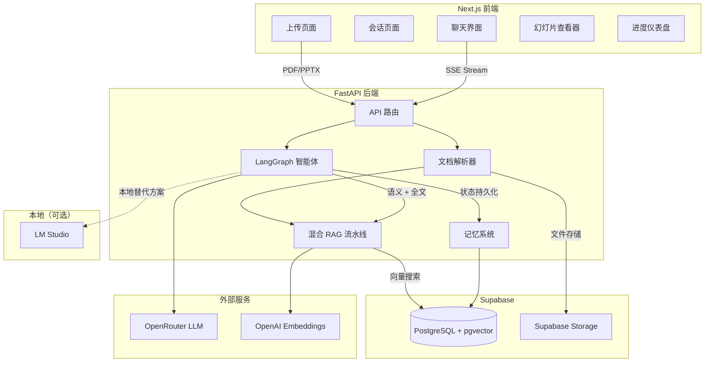

# SlideGuide

[English](README.md) | **中文**

AI 驱动的课件辅导工具。上传 PDF 或 PPTX 文件，SlideGuide 即可创建个性化学习会话，提供自适应讲解、互动测验和进度跟踪——专为神经多样性学习者设计。

## 架构



## 技术栈

| 层级 | 技术 | 用途 |
|------|------|------|
| 前端 | Next.js 14, TypeScript, Tailwind CSS, Zustand | UI 和状态管理 |
| 后端 | FastAPI, Python 3.11+ | API 服务器 |
| 智能体 | LangGraph | 多节点有状态辅导智能体 |
| LLM | OpenRouter (Claude Sonnet/Haiku, DeepSeek 备选) 或 LM Studio（本地） | 推理和生成 |
| 嵌入 | OpenAI text-embedding-3-small 或本地嵌入模型 | 语义搜索向量 |
| 数据库 | Supabase (PostgreSQL + pgvector) | 向量搜索、会话、进度、成本追踪 |
| 存储 | Supabase Storage | 上传文件持久化 |
| RAG | 混合搜索（语义 + 全文）→ RRF → MMR | 检索流水线 |

## 核心特性

- **5 种讲解模式**：标准、类比、可视化、分步骤、通俗易懂 (ELI5)
- **3 种节奏级别**：慢速、中速、快速
- **自适应测验**：难度根据表现自动调整
- **混合检索**：语义 + 关键词搜索，带多样性排序
- **VLM 图像理解**：描述幻灯片中的图表、示意图和图片
- **进度跟踪**：已覆盖主题、测验分数、置信度水平
- **SSE 流式传输**：实时逐 token 响应流
- **熔断器**：LLM 提供商之间的自动故障转移
- **本地 LLM 支持**：通过 LM Studio 完全离线运行——自动发现模型，适配工具调用

## 快速开始

### 前置要求

- Python 3.11+
- Node.js 18+
- [Docker](https://docs.docker.com/get-docker/)（Supabase CLI 需要）
- [Supabase CLI](https://supabase.com/docs/guides/cli)
- OpenRouter API 密钥（云端模式）**或** [LM Studio](https://lmstudio.ai/)（本地模式）

### 安装与运行

```bash
git clone https://github.com/yourusername/slideguide.git
cd slideguide
pip install -e "."
slideguide setup     # 交互式：检查前置要求、配置 .env、启动 Supabase、安装依赖
slideguide start     # 启动后端 + 前端，打开浏览器
```

就这样。访问 `http://localhost:3000` 开始使用 SlideGuide。

### CLI 命令

| 命令 | 描述 |
|------|------|
| `slideguide setup` | 交互式首次安装（前置要求、环境变量、数据库、依赖） |
| `slideguide start` | 启动所有服务（Supabase、后端、前端） |
| `slideguide stop` | 停止运行中的服务 |
| `slideguide restart` | 重启所有服务 |
| `slideguide dev` | 以开发模式启动（调试日志，不打开浏览器） |
| `slideguide status` | 显示服务状态表 |
| `slideguide doctor` | 运行全面的健康检查 |
| `slideguide logs` | 实时查看合并的服务日志 |
| `slideguide test` | 运行测试套件 |
| `slideguide db reset` | 重置本地数据库 |
| `slideguide db studio` | 在浏览器中打开 Supabase Studio |
| `slideguide config show` | 显示当前配置（密钥已脱敏） |
| `slideguide config edit` | 重新运行配置向导 |
| `slideguide config provider openrouter` | 快速切换 LLM 提供商 |
| `slideguide config validate` | 验证配置和 API 密钥 |

<details>
<summary>手动安装（不使用 CLI）</summary>

### 1. 克隆和配置

```bash
git clone https://github.com/yourusername/slideguide.git
cd slideguide
cp .env.example .env
# 编辑 .env，填入你的 API 密钥和 Supabase 凭据
```

### 2. 启动 Supabase

```bash
supabase start
supabase db reset
```

`supabase start` 完成后，将 `anon key` 和 `service_role key` 的值复制到 `.env` 中：

```bash
SUPABASE_URL=http://127.0.0.1:54321
SUPABASE_ANON_KEY=<supabase start 输出的 anon key>
SUPABASE_SERVICE_ROLE_KEY=<supabase start 输出的 service_role key>
```

### 3. 后端设置

```bash
pip install -e ".[dev]"
uvicorn backend.main:app --reload --port 8000
```

### 4. 前端设置

```bash
cd frontend
npm install
npm run dev
```

访问 `http://localhost:3000` 开始使用 SlideGuide。

### 5. 运行测试

```bash
pytest tests/ -v
```

</details>

## 使用本地 LLM（LM Studio）

SlideGuide 可以通过 [LM Studio](https://lmstudio.ai/) 使用本地模型完全离线运行，聊天无需 API 密钥。它使用与云端路径相同的 OpenAI 兼容 API，因此切换纯粹是配置层面的。

### 快速开始

1. **安装并启动 [LM Studio](https://lmstudio.ai/)**
2. **下载模型**——任何 GGUF 模型都可以。推荐：
   - 聊天：`mistral-nemo-instruct`、`llama-3.1-8b-instruct` 或 `qwen2.5-7b-instruct`
   - 嵌入：`nomic-embed-text-v1.5` 或 `bge-small-en-v1.5`
3. **加载模型**并启动 LM Studio 的本地服务器（默认：`http://localhost:1234`）
4. **设置 `.env`**：

```bash
# 将提供商切换为本地
LLM_PROVIDER=lmstudio
EMBEDDING_PROVIDER=lmstudio    # 可选——省略则保持使用 OpenAI 嵌入
VISION_PROVIDER=lmstudio       # 可选——仅在模型支持视觉时使用

# LM Studio 连接
LMSTUDIO_BASE_URL=http://localhost:1234/v1

# 模型名称——留空则从 LM Studio 自动发现
LMSTUDIO_PRIMARY_MODEL=
LMSTUDIO_ROUTING_MODEL=
LMSTUDIO_EMBEDDING_MODEL=
```

5. **正常启动 SlideGuide**——后端会自动从 LM Studio 发现已加载的模型。

### 提供商配置

每种能力（聊天、嵌入、视觉）可以独立指向不同的提供商：

| 变量 | 选项 | 默认值 |
|------|------|--------|
| `LLM_PROVIDER` | `openrouter`, `lmstudio` | `openrouter` |
| `EMBEDDING_PROVIDER` | `openai`, `lmstudio` | `openai` |
| `VISION_PROVIDER` | `openrouter`, `lmstudio` | `openrouter` |

**混合示例**——本地聊天 + 云端嵌入（最佳检索质量，免费生成）：

```bash
LLM_PROVIDER=lmstudio
EMBEDDING_PROVIDER=openai
OPENAI_API_KEY=sk-...
```

### 工作原理

- **自动发现**：启动时，后端向 LM Studio 的 `GET /v1/models` 查询已加载模型。如果 `LMSTUDIO_PRIMARY_MODEL` 为空，则选择第一个可用模型。
- **工具兼容性**：本地模型的函数调用支持不一致。SlideGuide 首先尝试原生 OpenAI 格式的工具调用，如果模型连续 3 次未能生成有效的工具调用，则自动切换到基于提示词的备选方案——将工具 schema 注入系统提示词并从响应中解析 JSON 块。
- **零成本追踪**：所有本地模型调用以 $0.00 计费——不受成本限制。
- **健康检查**：`GET /api/settings/provider` 报告 LM Studio 连接状态和已加载模型数量。
- **无备选链**：与云端模式（从 Claude 回退到 DeepSeek）不同，本地模式使用单一模型，无回退机制。

### 验证连接

运行后，检查提供商状态：

```bash
curl http://localhost:8000/api/settings/provider
```

你应该看到：

```json
{
  "llm_provider": "lmstudio",
  "models": { "primary": "your-model-name", ... },
  "lmstudio": { "status": "ok", "models_loaded": 1 }
}
```

### 提示

- **内存**：7B 模型需要约 6 GB 内存，13B 模型需要约 10 GB。请同时考虑 Supabase 服务的内存占用。
- **GPU 卸载**：在 LM Studio 中启用 GPU 层以大幅加速推理。
- **路由模型**：如果未设置，主模型同时处理推理和路由。为了更快的路由，加载一个更小的模型并将 `LMSTUDIO_ROUTING_MODEL` 设为其名称。
- **嵌入模型**：必须在 LM Studio 中与聊天模型一起单独加载。如果跳过本地嵌入，保持 `EMBEDDING_PROVIDER=openai`——OpenAI 的嵌入便宜且质量高。

## 项目结构

```
slideguide/
├── backend/
│   ├── agent/          # LangGraph 辅导智能体
│   │   ├── graph.py    # 图组装和路由
│   │   ├── nodes.py    # 智能体节点（路由、讲解、测验等）
│   │   ├── prompts.py  # 神经多样性友好的提示词模板
│   │   ├── state.py    # TutorState 模式
│   │   └── tools.py    # 7 个智能体工具（搜索、测验、进度等）
│   ├── db/             # Supabase 数据层
│   │   ├── client.py   # Supabase 客户端单例
│   │   └── repositories/
│   │       ├── chunks.py    # pgvector 向量块存储 + 搜索
│   │       ├── messages.py  # 聊天历史 CRUD
│   │       ├── progress.py  # 学生进度 CRUD
│   │       ├── sessions.py  # 会话 CRUD
│   │       ├── slides.py    # 幻灯片内容 CRUD
│   │       ├── storage.py   # Supabase Storage 操作
│   │       └── uploads.py   # 上传元数据 CRUD
│   ├── llm/            # LLM 客户端
│   │   ├── client.py   # OpenRouter 重试 + 熔断器
│   │   ├── discovery.py # LM Studio 模型自动发现
│   │   ├── models.py   # 模型配置和定价
│   │   ├── providers.py # 提供商配置解析（云端 vs 本地）
│   │   ├── streaming.py # SSE 流处理器
│   │   ├── tool_compatibility.py # 原生 ↔ 基于提示词的工具调用适配器
│   │   └── vision.py   # VLM 图像理解
│   ├── memory/         # 持久化层
│   │   ├── session_memory.py    # 对话摘要
│   │   └── student_progress.py  # 长期进度追踪
│   ├── models/
│   │   └── schemas.py  # 所有 Pydantic 模型
│   ├── monitoring/     # 可观测性
│   │   ├── health.py   # 健康检查（存活、就绪）
│   │   ├── logger.py   # 结构化日志（structlog）
│   │   └── metrics.py  # 成本和性能追踪
│   ├── parsers/        # 文档解析
│   │   ├── pdf_parser.py   # PyMuPDF
│   │   ├── pptx_parser.py  # python-pptx
│   │   └── ocr.py          # Tesseract + VLM 备选
│   ├── rag/            # 检索流水线
│   │   ├── vectorstore.py  # 基于 Supabase 的 pgvector 封装
│   │   ├── ingestion.py    # 分块 + 嵌入
│   │   ├── retriever.py    # 混合搜索 → RRF → MMR
│   │   └── evaluation.py   # 检索指标日志
│   ├── routes/
│   │   ├── chat.py     # 会话和消息 API 端点
│   │   └── settings.py # 提供商状态和模型列表
│   ├── config.py       # 应用设置
│   └── main.py         # FastAPI 应用入口
├── frontend/
│   ├── app/            # Next.js App Router 页面
│   ├── components/     # React 组件
│   ├── lib/            # API 客户端、store、类型、工具
│   └── package.json
├── supabase/
│   ├── config.toml     # 本地 Supabase CLI 配置
│   └── migrations/     # SQL 迁移（模式、pgvector、存储）
├── cli/               # CLI 工具（Typer）
│   ├── main.py        # 入口和命令注册
│   ├── config.py      # 路径、端口、平台检测
│   ├── commands/      # setup、services、status、db、config、test
│   └── utils/         # prereqs、env_builder、supabase、processes、health
├── tests/              # Python 测试
└── pyproject.toml      # Python 项目配置
```

## 技能展示

| 技能 | 实现 |
|------|------|
| **RAG 流水线** | 混合搜索（语义 + PostgreSQL 全文搜索）、倒数排名融合、MMR 多样性排序 |
| **智能体 AI** | LangGraph 多节点图，含条件路由、工具调用、状态持久化 |
| **LLM 工程** | 指数退避重试、熔断器、模型备选链、成本追踪、通过 LM Studio 支持本地 LLM |
| **提供商抽象** | 可插拔提供商配置、本地模型自动发现、自适应工具调用兼容层 |
| **提示词工程** | 5 种讲解模式、自适应测验难度、神经多样性友好格式 |
| **文档处理** | PDF (PyMuPDF) + PPTX 解析、VLM 备选 OCR、幻灯片感知分块 |
| **多模态** | VLM 图表/示意图描述、base64 编码、上下文注入 |
| **流式传输** | SSE 逐 token 流式传输、工具调用组装、心跳保活 |
| **可观测性** | 结构化日志（structlog）、逐模型指标、健康检查（存活/就绪） |
| **数据库设计** | Supabase (PostgreSQL + pgvector)、仓储模式、SQL 迁移、Storage API |
| **前端** | Next.js 14、Zustand 状态管理、SSE 消费、响应式三栏布局、深色模式 |

## API 参考

| 方法 | 端点 | 描述 |
|------|------|------|
| `POST` | `/api/upload` | 上传 PDF 或 PPTX 文件进行处理 |
| `GET` | `/api/upload/{upload_id}` | 获取上传状态和元数据 |
| `GET` | `/api/upload/{upload_id}/slides` | 列出上传文件的所有幻灯片 |
| `POST` | `/api/session` | 创建新的辅导会话 |
| `GET` | `/api/session/{session_id}` | 获取会话状态 |
| `POST` | `/api/session/{session_id}/message` | 发送消息（返回 SSE 流） |
| `GET` | `/api/session/{session_id}/history` | 获取会话的聊天历史 |
| `GET` | `/api/settings/provider` | 获取当前提供商配置 |
| `GET` | `/api/settings/models` | 列出可用模型 |
| `GET` | `/health/live` | 存活检查 |
| `GET` | `/health/ready` | 就绪检查 |

## 许可证

本项目采用 AGPL-3.0 许可证——详见 [LICENSE](LICENSE)。
